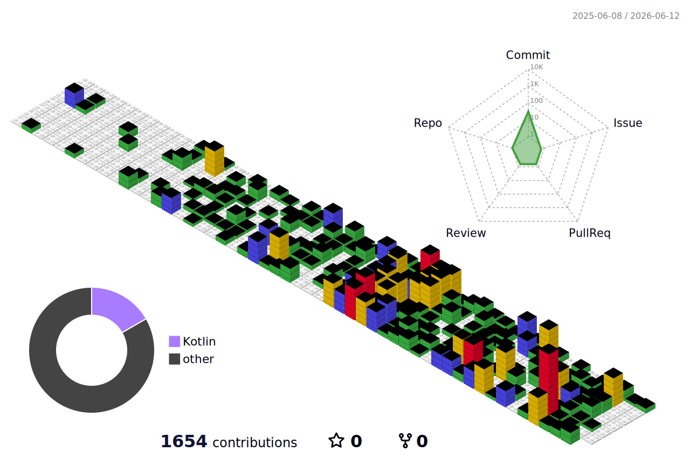

# Jinsung Joo

*I build products and ship them.*

 

  

## 📱 Readip

영어 원서 읽기 & 단어 학습 앱을 직접 만들고 운영하고 있습니다. (iOS / Android)

---

## 🏢 Work

패션 산업을 위한 AI 플랫폼을 만들고 있습니다.
자연어 한 줄이면 데이터 검색, 등록, 분석까지 — 업무 전체를 AI가 처리하는 시스템.

### 📊 Stats

  

