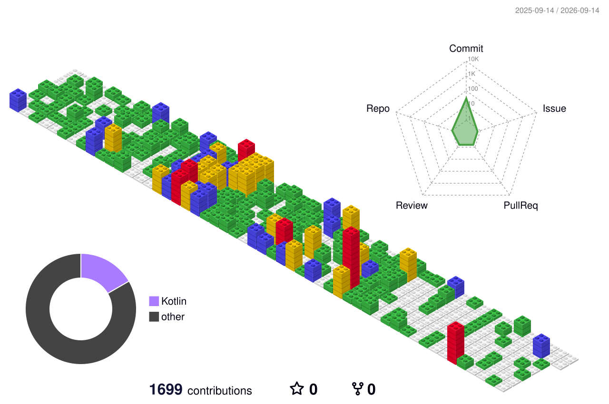

# Jinsung Joo

*I build products and ship them.*

 

  

## 💻 Work

삼성 제조 현장에 적용되는 AMR 및 로봇 시스템 소프트웨어를 개발하고 있습니다. Python과 C++을 사용해 HMI와 장비 간 통신 및 제어를 담당하는 브릿지 소프트웨어를 개발하고 개선하며, 현장 이슈 분석과 소프트웨어 적용 및 검증을 수행합니다.

## 📱 Previous Experience

### Readip
영어 원서 읽기와 단어 학습을 위한 iOS/Android 앱을 직접 개발하고 운영한 경험이 있습니다.

### 패션 산업 AI 플랫폼
자연어로 데이터 검색, 등록, 분석을 수행하는 AI 플랫폼 개발에 참여했습니다.

### 📊 Stats

  

